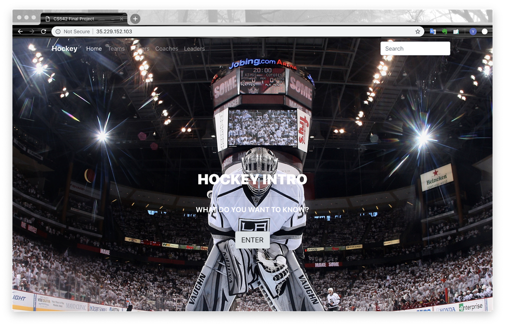
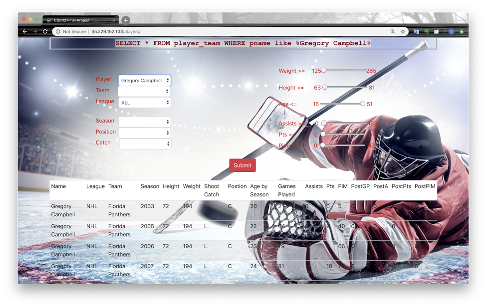
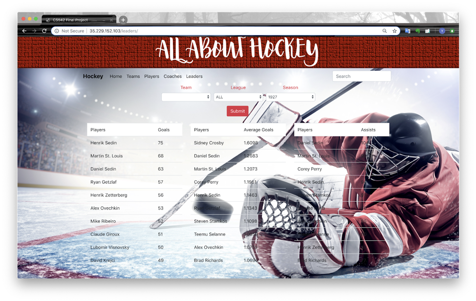
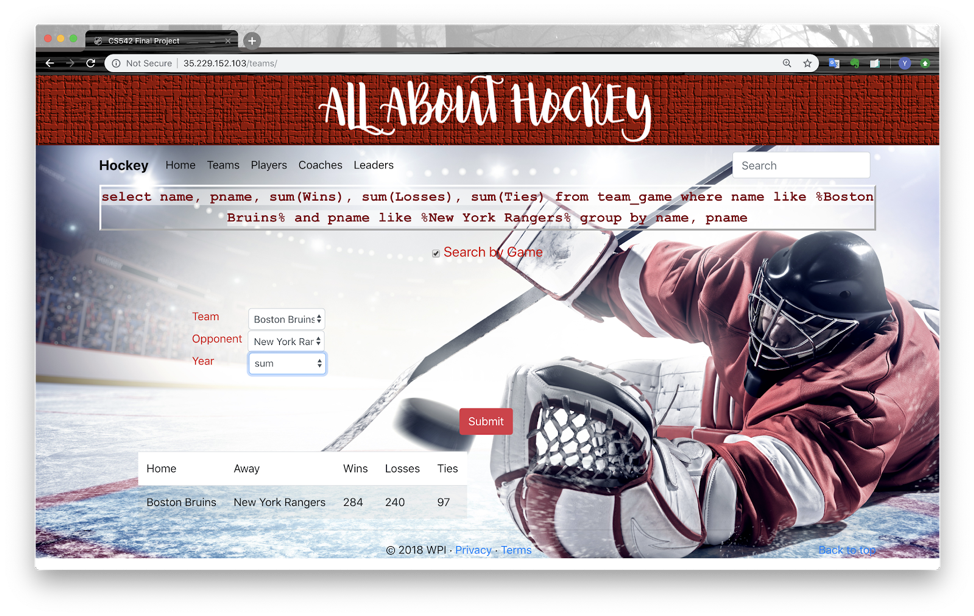

# NHL.com
NHL.com is the web site of the National Hockey League, which provide users with various way to access NHL games stats.

Website Demo: [NHL.com](http://35.229.152.103) 

### Home Page

### Player Pages

## Overview
We are aiming to develop a visualized interactive query website “All about Hockey” based on the Hockey database. The Hockey database stores records of players, teams, coaches and their performances during 1909-2011, which is downloaded from the KAGGLE. The basic functionality of the website we achieved is to output the results from the dataset by applying multiple filters. More important, the website can do simple data analysis by revealing top players  of a team evaluated from different fields to help make comparisons.

The website is built for free-use and is a not-for-profit product. We target customers who are fans interested in Hockey and offers them with interesting and thorough information about the game. By viewing the four subpages (Teams, Players, Coaches and Leaders) and using filters to generate the customized results by themselves, our potential customers can always get what they want to know from the website.

More up-to-date information and complicated functionalities will be added into the database and shown on the website in the future. We also welcome the information, data or functionality suggestions from the website viewers, which will help us improve the website.

## Background Material
We use ER diagram and Relational Model to build the database. And designing proper triggers and constraints help us better maintain the database. For the reason that we would like to join several related tables to get overall information about an entity, we use views to help us get rid of long nested queries. Aiming to optimize our queries and make the website much quicker, we also build clustered tree index on the potentially most frequent-retrieved attributes.
- An entity–relationship model (ER model for short) describes interrelated things of interest in a specific domain of knowledge. A basic ER model is composed of entity types (which classify the things of interest) and specifies relationships that can exist between instances of those entity types.

- The relational model (RM) for database management is an approach to managing data using a structure and language consistent with first-order predicate logic, where all data is represented in terms of tuples, grouped into relations. A database organized in terms of the relational model is a relational database.
 

As for developing the website, we apply HTML, Cascading Style Sheets (CSS), JavaScript and Flask to fulfill the functions of query, simple analysis and interactivity.
The relational model (RM) for database management is an approach to managing data using a structure and language consistent with first-order predicate logic, where all data is represented in terms of tuples, grouped into relations. A database organized in terms of the relational model is a relational database.
- Cascading Style Sheets allow for flexible formatting of a page. They should be used instead of tables for non-tabular content whenever possible, because they can be manipulated by the reader or overridden by an author if your CSS is embedded in another page via a template.
- Flask is a micro web framework written in Python. It is classified as a microframework because it does not require particular tools or libraries. It has no database abstraction layer, form validation, or any other components where pre-existing third-party libraries provide common functions.

In order to achieve a full-functioned and well-designed Hockey website, we conduct research on several similar sports statistics website for inspiration, such as the NBA official website and the National Hockey League official website. Both have done a great job in demonstrating the sports statistics and been a perfect example for us to build the “All about Hockey” website.

What we have learnt from them are:
- Up-to-date data;
- Reasonable filters with multiple application methods;
- Functional web design;
- Fancy and interactive website elements, such as the bar charts comparing players and teams.

What we have improved based on these websites are:
- Additional table and information for coaches. Because we think that the data for coaches is also important for Hockey fans, with which he or she can check the couching history of his or her couches, or the historic couches who couches his or her favourite team;
- We have combined the multiple-aspect performance ranking of players in each team, and users can search for the top players by team name and year;
- The web design is more flexible and colorful compared with the official sports website, with red as the main color chaining the subpages.

## Appendix
### Team Page

### Games Page

